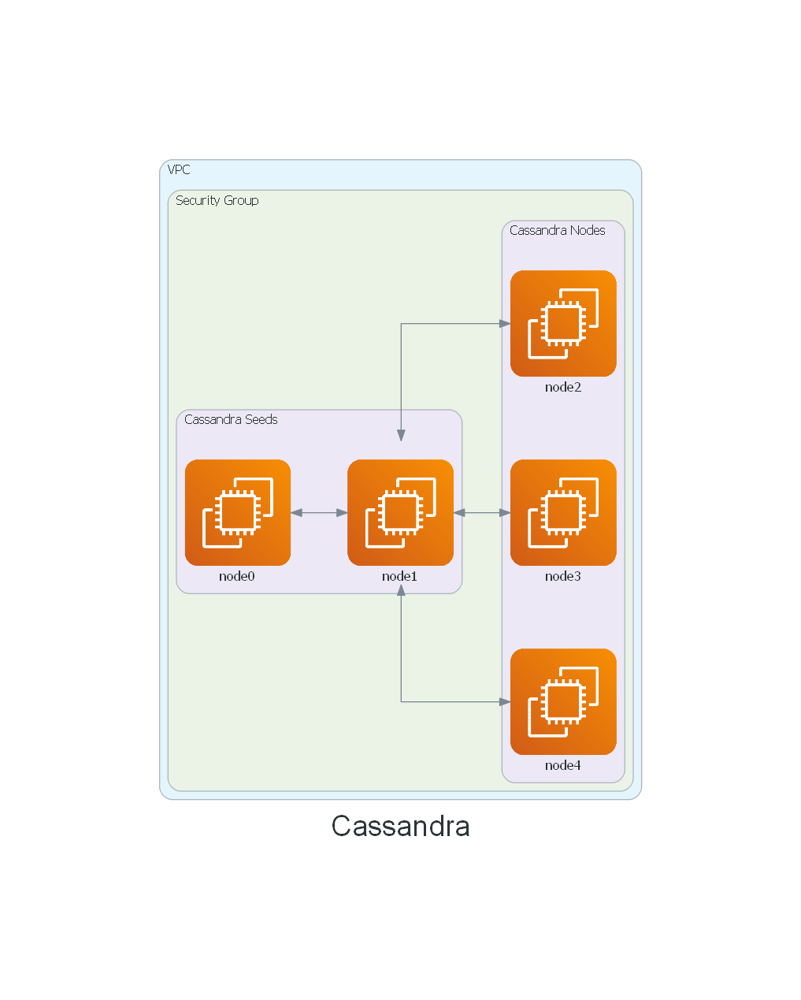

# terraform-aws-cassandra

[](https://github.com/JamesWoolfenden/terraform-aws-cassandra)
[](https://github.com/JamesWoolfenden/terraform-aws-cassandra/releases/latest)
[](https://github.com/pre-commit/pre-commit)
[](https://www.checkov.io/)
[](https://www.bridgecrew.cloud/link/badge?vcs=github&fullRepo=JamesWoolfenden%2Fterraform-aws-cassandra&benchmark=INFRASTRUCTURE+SECURITY)
[](https://www.bridgecrew.cloud/link/badge?vcs=github&fullRepo=JamesWoolfenden%2Fterraform-aws-cassandra&benchmark=CIS+AWS+V1.2)
[](https://www.bridgecrew.cloud/link/badge?vcs=github&fullRepo=JamesWoolfenden%2Fterraform-aws-cassandra&benchmark=PCI-DSS+V3.2)

A project to set up infrastructure in AWS for an Apache Cassandra cluster. This module will create Cassandra on EC2 and auto-cluster all of its nodes.

---


It's 100% Open Source and licensed under the [APACHE2](LICENSE).

## Usage

The folder **example/examplea** contains a complete sample illustration of how to use this module.

```tree
├───examplea
│       data.tf
│       examplea.auto.tfvars
│       Makefile
│       module.cassandra.tf
│       outputs.tf
│       provider.aws.tf
│       variables.tf
```

As a minimum you must include a module reference in your own template Terraform code e.g. **module.cassandra.tf**:

```hcl
module "cassandra" {
  source            = "JamesWoolfenden/cassandra/aws"
  version           = "0.3.1"
  instance_type     = var.instance_type
  subnet_ids        = data.aws_subnet_ids.subs.ids
  #add the private ips
  private_ips       = []
  allowed_ranges    = [module.myip.cidr]
  ssh-inbound-range = [module.myip.cidr]
  ami               = local.ami
  vpc_id            = tolist(data.aws_vpcs.main.ids)[0]
}
```

You will also need to define variables **variables.tf** and supply values **examplea.auto.tfvars**.
You'll need to adjust the values to your own.
You will also need build a Cassandra AMI, see the Packer folder for that template.
If you want to test the modules usage execute Terraform in the examplea folder:

```cli
cd example/examplea
✔ /mnt/c/code/jimw/aws/terraform-aws-cassandra/example/examplea [master|✚ 1⚑ 1]
09:56 $ make init
rm -rf .terraform/
terraform init -reconfigure
Initializing modules...
- cassandra in ../..
Downloading jameswoolfenden/ip/http 0.2.7 for myip...
- myip in .terraform/modules/myip/terraform-http-ip-0.2.7

Initializing the backend...

Initializing provider plugins...
- Checking for available provider plugins...
- Downloading plugin for provider "aws" (hashicorp/aws) 2.54.0...

Terraform has been successfully initialized!

You may now begin working with Terraform. Try running "terraform plan" to see
any changes that are required for your infrastructure. All Terraform commands
should now work.

If you ever set or change modules or backend configuration for Terraform,
rerun this command to reinitialize your working directory. If you forget, other
commands will detect it and remind you to do so if necessary.

terraform apply
....
```

## Costs

```text
monthly cost estimate

Project: .

 Name                                                   Monthly Qty  Unit            Monthly Cost

 module.cassandra.aws_instance.cassandra[0]
 ├─ Instance usage (Linux/UNIX, on-demand, t3.micro)            730  hours                  $8.61
 ├─ EC2 detailed monitoring                                       7  metrics                $2.10
 ├─ CPU credits                                                   0  vCPU-hours             $0.00
 └─ root_block_device
    ├─ Storage (magnetic)                                       100  GB-months              $5.80
    └─ I/O requests                                   Cost depends on usage: $0.06 per 1M request

 module.cassandra.aws_instance.cassandra[1]
 ├─ Instance usage (Linux/UNIX, on-demand, t3.micro)            730  hours                  $8.61
 ├─ EC2 detailed monitoring                                       7  metrics                $2.10
 ├─ CPU credits                                                   0  vCPU-hours             $0.00
 └─ root_block_device
    ├─ Storage (magnetic)                                       100  GB-months              $5.80
    └─ I/O requests                                   Cost depends on usage: $0.06 per 1M request

 module.cassandra.aws_instance.cassandra[2]
 ├─ Instance usage (Linux/UNIX, on-demand, t3.micro)            730  hours                  $8.61
 ├─ EC2 detailed monitoring                                       7  metrics                $2.10
 ├─ CPU credits                                                   0  vCPU-hours             $0.00
 └─ root_block_device
    ├─ Storage (magnetic)                                       100  GB-months              $5.80
    └─ I/O requests                                   Cost depends on usage: $0.06 per 1M request

 PROJECT TOTAL                                                                             $49.54
```

<!-- BEGINNING OF PRE-COMMIT-TERRAFORM DOCS HOOK -->
## Requirements

No requirements.

## Providers

| Name | Version |
|------|---------|
| <a name="provider_aws"></a> [aws](#provider\_aws) | n/a |

## Modules

No modules.

## Resources

| Name | Type |
|------|------|
| [aws_instance.cassandra](https://registry.terraform.io/providers/hashicorp/aws/latest/docs/resources/instance) | resource |
| [aws_security_group.cassandra](https://registry.terraform.io/providers/hashicorp/aws/latest/docs/resources/security_group) | resource |
| [aws_ami.ami](https://registry.terraform.io/providers/hashicorp/aws/latest/docs/data-sources/ami) | data source |

## Inputs

| Name | Description | Type | Default | Required |
|------|-------------|------|---------|:--------:|
| <a name="input_allowed_ranges"></a> [allowed\_ranges](#input\_allowed\_ranges) | Allowed ranges that can access the cluster | `list(any)` | <pre>[<br>  "0.0.0.0/0"<br>]</pre> | no |
| <a name="input_ami"></a> [ami](#input\_ami) | Contains information to select desired AWS AMI | `any` | n/a | yes |
| <a name="input_config-file"></a> [config-file](#input\_config-file) | n/a | `string` | `"/etc/dse/cassandra/cassandra.yaml"` | no |
| <a name="input_iam_instance_profile"></a> [iam\_instance\_profile](#input\_iam\_instance\_profile) | n/a | `string` | `""` | no |
| <a name="input_instance_type"></a> [instance\_type](#input\_instance\_type) | aws instance type and class | `string` | n/a | yes |
| <a name="input_private_ips"></a> [private\_ips](#input\_private\_ips) | List of ips for the cassandra nodes | `list(any)` | n/a | yes |
| <a name="input_ssh-inbound-range"></a> [ssh-inbound-range](#input\_ssh-inbound-range) | CIDRs of address that are allowed to ssh in. | `list(any)` | n/a | yes |
| <a name="input_subnet_ids"></a> [subnet\_ids](#input\_subnet\_ids) | List of subnet Ids | `list(any)` | n/a | yes |
| <a name="input_template-file"></a> [template-file](#input\_template-file) | n/a | `string` | `"cassandra.tmpl"` | no |
| <a name="input_vpc_id"></a> [vpc\_id](#input\_vpc\_id) | The id for the vpc | `string` | n/a | yes |

## Outputs

| Name | Description |
|------|-------------|
| <a name="output_instances"></a> [instances](#output\_instances) | n/a |
| <a name="output_security_group"></a> [security\_group](#output\_security\_group) | n/a |
<!-- END OF PRE-COMMIT-TERRAFORM DOCS HOOK -->

## Policy

<!-- BEGINNING OF PRE-COMMIT-PIKE DOCS HOOK -->
The Terraform resource required is:

```golang
resource "aws_iam_policy" "terraform_pike" {
  name_prefix = "terraform_pike"
  path        = "/"
  description = "Pike Autogenerated policy from IAC"

  policy = jsonencode({
    "Version": "2012-10-17",
    "Statement": [
        {
            "Sid": "VisualEditor0",
            "Effect": "Allow",
            "Action": [
                "ec2:AuthorizeSecurityGroupEgress",
                "ec2:AuthorizeSecurityGroupIngress",
                "ec2:CreateSecurityGroup",
                "ec2:DeleteSecurityGroup",
                "ec2:DescribeAccountAttributes",
                "ec2:DescribeImages",
                "ec2:DescribeInstanceAttribute",
                "ec2:DescribeInstanceCreditSpecifications",
                "ec2:DescribeInstanceTypes",
                "ec2:DescribeInstances",
                "ec2:DescribeNetworkInterfaces",
                "ec2:DescribeSecurityGroups",
                "ec2:DescribeTags",
                "ec2:DescribeVolumes",
                "ec2:ModifyInstanceAttribute",
                "ec2:MonitorInstances",
                "ec2:RevokeSecurityGroupEgress",
                "ec2:RevokeSecurityGroupIngress",
                "ec2:RunInstances",
                "ec2:StartInstances",
                "ec2:StopInstances",
                "ec2:TerminateInstances",
                "ec2:UnmonitorInstances"
            ],
            "Resource": [
                "*"
            ]
        }
    ]
})
}


```
<!-- END OF PRE-COMMIT-PIKE DOCS HOOK -->
## Related Projects

Check out these related projects.

- [terraform-aws-codebuild](https://github.com/jameswoolfenden/terraform-aws-codebuild) - Making a Build pipeline

## Help

**Got a question?**

File a GitHub [issue](https://github.com/jameswoolfenden/terraform-aws-cassandra/issues).

## Contributing

### Bug Reports & Feature Requests

Please use the [issue tracker](https://github.com/jameswoolfenden/terraform-aws-cassandra/issues) to report any bugs or file feature requests.

## Copyrights

Copyright © 2019-2022 James Woolfenden

## License

[](https://opensource.org/licenses/Apache-2.0)

See [LICENSE](LICENSE) for full details.

Licensed to the Apache Software Foundation (ASF) under one
or more contributor license agreements. See the NOTICE file
distributed with this work for additional information
regarding copyright ownership. The ASF licenses this file
to you under the Apache License, Version 2.0 (the
"License"); you may not use this file except in compliance
with the License. You may obtain a copy of the License at

<https://www.apache.org/licenses/LICENSE-2.0>

Unless required by applicable law or agreed to in writing,
software distributed under the License is distributed on an
"AS IS" BASIS, WITHOUT WARRANTIES OR CONDITIONS OF ANY
KIND, either express or implied. See the License for the
specific language governing permissions and limitations
under the License.

### Contributors

[![James Woolfenden][jameswoolfenden_avatar]][jameswoolfenden_homepage]<br/>[James Woolfenden][jameswoolfenden_homepage]

[jameswoolfenden_homepage]: https://github.com/jameswoolfenden
[jameswoolfenden_avatar]: https://github.com/jameswoolfenden.png?size=150
